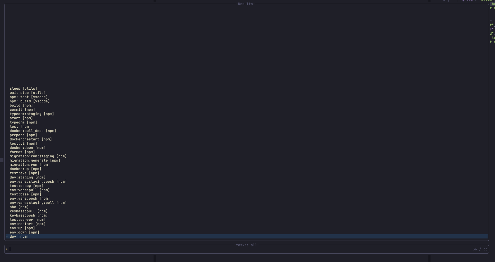
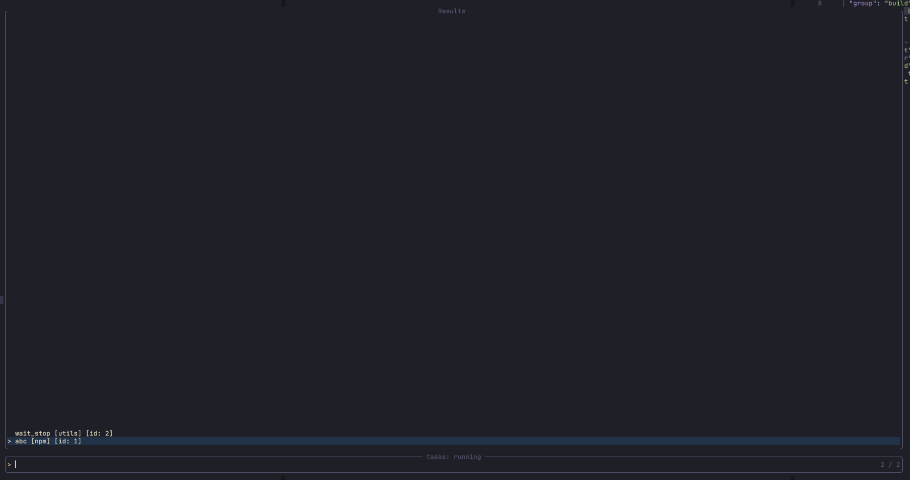
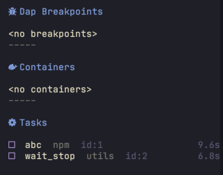

# tasks.nvim

## State

Alpha

Dependencies:

- https://github.com/nvim-lua/plenary.nvim
- `jsonc` treesitter parser (optional - only needed if you're using the `tasks.json` source)

Neovim versions:

- `0.7.2`
- `nightly`

## Installation

With Packer:

```lua
use({ "GustavoKatel/tasks.nvim", requires = { "nvim-lua/plenary.nvim" } })
```

## Configuration

Calling `setup` is not mandatory

Example:

```lua
local tasks = require("tasks")

local source_npm = require("tasks.sources.npm")
local source_tasksjson = require("tasks.sources.tasksjson")

local Source = require("tasks.lib.source")

require("telescope").load_extension("tasks")

tasks.setup({
	sources = {
		npm = source_npm,
		vscode = source_tasksjson,
		utils = Source:create({ specs = {
			sleep = {
				fn = function(ctx, args)
					local pasync = require("plenary.async")

					pasync.util.sleep(10000)
				end,
			},

            vim_cmd = {
                vcmd = "echo 'ok'"
            },

            shell_cmd = {
                cmd = "make test"
            }
		}}),
	},
})

```

## Sources

### npm

It will load all `package.json` scripts from the project root to be used as task specs.

Example:

```lua
local source_npm = require("tasks.sources.npm")

tasks.setup({
  sources = {
    ["js/ts (yarn)"] = source_npm:with({ script_runner = { "yarn" } })
    -- this one will still use npm
    ["js/ts (npm)"] = source_npm
    -- using a different package.json path
    ["subpackage (npm)"] = source_npm:with({ filename = "frontend/app/package.json" })
  }
})
```

### tasksjson (vscode)

It will load all tasks from `.vscode/tasks.json` to be used as task specs.

There are bunch of things missing from the schema, I believe it's enough to get started. Please open an issue if you think any of the missing features should be added.

### dap

It will load all configurations from `dap.configurations` and also configurations from `launch.json` (See: https://code.visualstudio.com/docs/editor/debugging)

It works well when combined with `tasksjson` when using attributes like `preLaunchTask` and `postDebugTask`.

### cargo

It will provide three specs when it finds a `Cargo.toml` in the root directory.

Specs:

- cargo run
- cargo watch
- cargo test

## Runners

### builtin

The builtin runner is a generic runner that allows you to run lua functions, vim commands or shell commands (using the terminal `:e term://...`)

It's always available, even if you don't specify in your config.

You can override the builtin runner like so:

```lua
tasks.setup({
    ...
	runners = {
        -- use a completely different runner:
        builtin = my_custom_runner
        -- or override the builtin settings with
		builtin = runner_builtin:with({ terminal_edit_command = "split" }),
	},
})
```

### Custom runners

A very minimal custom runner that runs lua functions (async functions) can be created as such:

```lua
local Task = require("tasks.lib.task")
local Runner = require("tasks.lib.runner")
local tasks = require("tasks")

tasks.setup({
    ...
    runners = {
        custom_runner = Runner:create({
            create_task = function(self, spec, args)
                local fn = function(ctx, args)
                    print("running from custom runner")
                    local ret = spec.fn(args)
                    print("custom runner done!")
                    return ret
                end
                return Task:new(fn, args)
            end
        })
    },

    sources = {
        my_tasks = Source:create({ specs = {
			sleep = {
				fn = function(ctx)
					local pasync = require("plenary.async")

					pasync.util.sleep(10000)
				end,
                -- this prop will route this task to the custom runner
                runner_name = "custom_runner"
			},
		}}),
    }
})
```

### Custom router

You can specify a router function to better match specs with runners. This will override the `runner_name` in the specs.

```lua
tasks.setup({
    runners = { ... },
    sources = { ... },
    router = function(spec_name, spec, args, source_name)
        -- this will run all specs from the `npm` source in runner with name `my_custom_runner`
        if source_name == "npm" then
            return "my_custom_runner"
        end
        return nil -- fallback to use the default router value
    end
})
```

## Integrations

### Telescope

```
:Telescope tasks specs
```

Shows all the available specs from all sources.

The default action will create and run a new task.



```
:Telescope tasks running
```

Shows all current running tasks.

The default action will request the task to stop (call `task:request_stop()`).



#### Default keybindings

The extension provides some default keybindings which you can override like so:

> *Note*
> this is just to illustrate, don't use as is

```lua
local tasks_actions = require("telescope._extensions.tasks.actions")

require("telescope").setup({
    extensions = {
		tasks = {
            mappings = {
                -- mappings for the "running tasks" picker
                running = {
                    i = {
                        <select_default> = tasks_actions.open_buffer({ cmd = { "buffer" } }),
                        ["<c-c>"] = tasks_actions.request_stop,
                    },
                },

                specs = {
                    i = {
                        <select_default> = tasks_actions.run,
                        ["<c-t>"] = tasks_actions.run_with_runner_opts({ terminal_edit_command = "vsplit" }),
                    },
                },
            },
        }
    }
})
```

### sidebar.nvim integration

```lua
local tasks_section = require("sidebar-nvim.sections.tasks")

local sidebar = require("sidebar-nvim")

sidebar.setup({
    ...
    sections = { tasks_section }
    ...
})
```



### statusline/tabline/winbar

Minimal integration for lualine

```lua
lualine.setup({
    ...
    sections = {
        lualine_c = {
            require("tasks.statusline.running")("<custom_icon or prefix>")
        }
    }
    ...
})
```

## API

### tasks.run(spec_name, args, source_name, runner_opts)

Run the first spec with name `spec_name` additionally passing extra args in `args`

You can also pass `source_name` to refine the search and only run specs from that source.

You can also pass `runner_opts` that will be consumed by the runner.

Returns `task_id` and a task table ([Task](./doc/task.md))

### tasks.run_last()

Re-run the last spec with the same args passed in the last call to `tasks.run`

Returns `task_id` and task table

### tasks.get_specs({ source_name = nil, runner_name = nil })

Get all the available specs. Optionally filter by spec name `spec_name` and runner name `runner_name`.

Returns dictionary

Example of return value:

```lua
{
    ["my_source"] = {
        ["spec_1"] = {
            ...
        },
        ["spec_2"] = {
            ...
        }
    },
    [<source_name>] = {
        [<spec_name>] = <spec>
    }
}
```

### tasks.get_running_tasks({ source_name = nil, runner_name = nil })

Get all the tasks currently running. Optionally filter by spec name `spec_name` and runner name `runner_name`.

Returns dictionary

Example of return value:

```lua
{
    [1] = <task>,
    [2] = <task>,
    ...
    [<task_id>] = <task>
}
```

## More docs

- Task api - [task.md](./doc/task.md)
- Spec api - [task.md](./doc/spec.md)
- Source api - [source.md](./doc/source.md)
- Builtin runner - [runner_builtin.md](./doc/runner_builtin.md)
- [docs folder](./doc)

## Credits

Thanks to [yngwi](https://github.com/yngwi) for help testing and providing feedback and ideas in [the Reddit post](https://www.reddit.com/r/neovim/comments/vqsoyo/tasksnvim_yet_another_task_runnermanager_for/)
